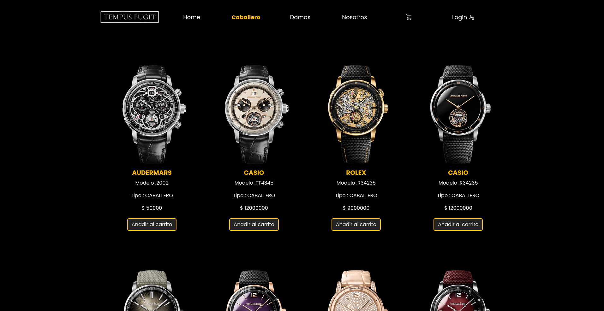

# Tienda de Relojes – Proyecto Tempus

Este proyecto es una aplicación web desarrollada en PHP para la gestión y venta de relojes, creada como práctica académica para la asignatura de Programación Web (Ingeniería de Software, 4º semestre). El sistema permite la administración de productos, usuarios, clientes, ventas y carrito de compras, integrando reglas de negocio y una arquitectura modular.

## Tecnologías y herramientas utilizadas
- **PHP 8.4** (con Apache)
- **MySQL 8.3**
- **Docker & Docker Compose**
- **phpMyAdmin**
- HTML5, CSS3, Bootstrap
- JavaScript

## Estructura del proyecto
```
ProyectoRelojeria/
├── docker-compose.yml         # Orquestación de servicios
├── Dockerfile                # Imagen personalizada de PHP+Apache
├── src/                      # Código fuente principal
│   ├── index.php             # Punto de entrada
│   ├── classes/              # Clases de negocio (Carrito, Cliente, Reloj, User, etc.)
│   ├── controller/           # Controladores por módulo
│   ├── configs/              # Configuración de la app y la base de datos
│   ├── database/             # Scripts SQL y migraciones
│   ├── layout/               # Vistas, plantillas y parciales (header, footer)
│   ├── routes/               # Definición de rutas
│   ├── assets/               # Recursos estáticos (css, js, imágenes)
│   └── img/                  # Imágenes del sistema
├── php.ini/                  # Configuración personalizada de PHP (opcional)
├── .gitignore
├── README.md
└── README.txt                # Instrucciones adicionales
```

## Instalación y despliegue rápido con Docker

1. **Clona el repositorio:**
   ```bash
   git clone <url-del-repositorio>
   cd ProyectoRelojeria
   ```

2. **Configura las variables de entorno:**
   - Crea un archivo `.env` en la raíz con el siguiente contenido (ajusta las contraseñas si lo deseas):
     ```env
     MYSQL_DATABASE=fugit
     MYSQL_USER=tempus_user
     MYSQL_PASSWORD=tempus_pass
     MYSQL_ROOT_PASSWORD=rootpass
     ```

3. **Levanta los servicios:**
   ```bash
   docker-compose up --build
   ```
   Esto iniciará:
   - La aplicación PHP en [http://localhost:8080](http://localhost:8080)
   - phpMyAdmin en [http://localhost:8081](http://localhost:8081)
   - MySQL en el puerto 3307

4. **Base de datos:**
   - El script `src/database/db.sql` se ejecuta automáticamente al levantar el contenedor de MySQL, creando la base de datos y tablas necesarias.
   - Puedes acceder a phpMyAdmin para gestionar la base de datos visualmente.

## Configuración manual (sin Docker)

1. Instala PHP 8.4+, Apache y MySQL 8.3 en tu entorno local.
2. Configura el archivo `src/configs/database.php` con tus credenciales de base de datos.
3. Importa el script `src/database/db.sql` en tu servidor MySQL.
4. Ajusta las rutas en `src/configs/config.php` si es necesario.
5. Coloca el contenido de `src/` en el directorio público de tu servidor web.

## Funcionalidades principales
- Gestión de usuarios, clientes, productos (CRUD completos)
- Carrito de compras y ventas
- Regla de negocio: **Descuento del 30%** en compras superiores a $1'000.000 COP
- Interfaz modular y navegación por roles
- Personalización visual con Bootstrap y CSS propio

## Vista previa

A continuación se muestran capturas de pantalla de la aplicación web en funcionamiento:




## Créditos
- Hamilton Damian Lopez Gutierrez
- Juan Manuel Arenas Rincón
- Daniela Villalba

---

> Proyecto académico – Universidad EAM